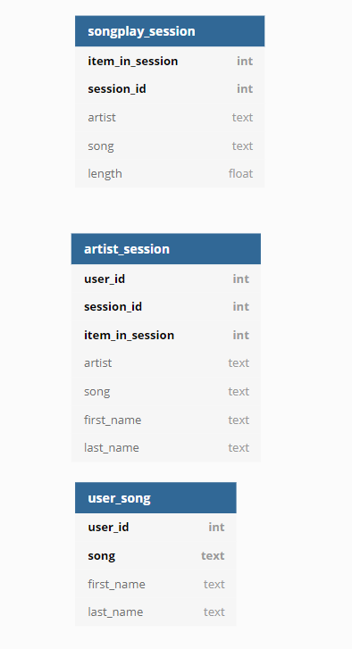

# Project: Data Modeling with Cassandra
# Summary

A startup called Sparkify wants to analyze the data they've been collecting on songs and user activity on their new music streaming app. The analysis team is particularly interested in understanding what songs users are listening to. Currently, there is no easy way to query the data to generate the results, since the data reside in a directory of CSV files on user activity on the app.

In this project creates database with Apache Cassandra with an ETL pipeline using Python. 

For this project a dataset is provided: event_data. It contains directory of CSV files partitioned by date, for example:

* event_data/2018-11-08-events.csv
* event_data/2018-11-09-events.csv

**Project contains two scripts:**

* **create_tables.py**: This script drops existing tables and creates new ones.
* **etl.py**: This script takes data from ./event_data and inserts it into DB.

## About Database

DB schema is the following:

_*SparkifyDB schema in ER Diagram.*_

## HOWTO use
Run create_tables.py by executing the following statement:

`python3 create_tables.py`

Run etl.py by executing the following statement:

`python3 etl.py`

Provided is a script to run the test quires against the database. Run the following statement to execute the script:

`python3 sql_queries.py`
